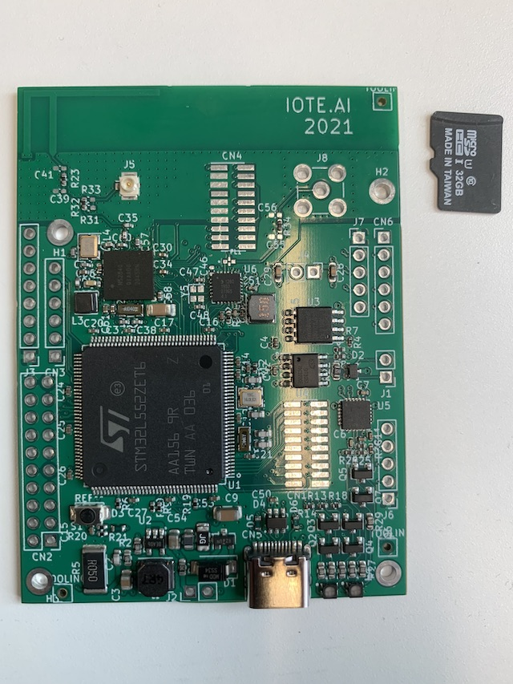

.. _iote_ai_l552ze_board:

IOTE.AI L552ZE
###############

Overview
********

The IOTE.AI L552ZE board, featuring an ARM Cortex-M33 based STM32L552ZE MCU,
was built as a development board featuring Bluetooth and LoRa. Benefits of this
custom board:

- MIPI20T pin headers Lauterbach trace connector
- Pin header for easily connecting the Lauterbach Analog Probe 
- The board can be powered via external source or USB
- NRF52840 for Bluetooth
- Semtech SX1280 for LoRa
- Integrated PCB antenna
- Optionally UFL and SMA connectors for antennas

